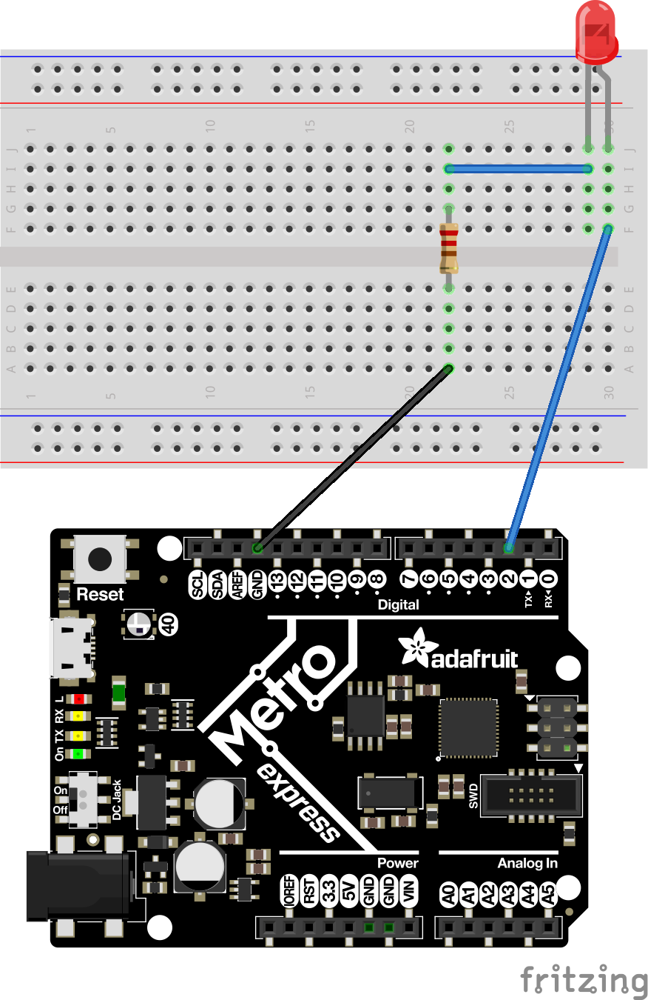
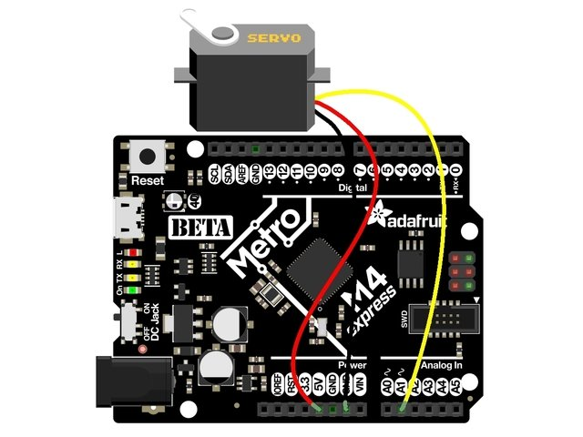

# CircuitPython
My CircuitPython assignments. These are the beggining stages of using CircuitPython. These beginner assignments to help me learn about how to write CircuitPython.
## Hello CircuitPython
### Objective
My objective is to start learning a new coding language called CircuitPython. This assignment is the intro to the new language, the objective is to make an LED fade in and out.
### Pictures

### Lesson
I learned about how the PWM is the pulse width modulation (how long the pusle is up or down). I also learned that the duty cycle is how long the pusles stay up or down.
## CircuitPython Servo
### Objective
The objective of this assignment is to make a servo slowly sweep between 0 and 180 degrees. We also had to make the servo move simply by touching a wire (capacitive touch). 
### Pictures

### Lesson
I learned that the PWM encodes information by modulating the width of a pulse. Those pulses (and the width and frequency of them) are what the servo interprets as a message. I also learned how to use capacitive touch; when I touched one wire, the servo would rotate to 180 degrees and when I touched another wire it would go back to zero.
## CircuitPython LCD
### Objective
The objective of this assignment is to make an LCD screen print how many times the button has been pressed, and once the switch was flipped it would go down when you pressed the button. 
### Pictures

### Lesson
I learned how to use variables in my true and false statements and I learned what "Pull up or down" is. To pull up basically means to 
pull up the state of the line high so it reads as true.
## CircuitPython Photointerrupter
### Objective
The objective of this assignment is to use a photointerrupter to count how many times it has been interrupted, and then print that onto an LCD screen. 
### Pictures
 

Instead of having a light turn on it would count how many times it was interrupted on an LCD screen.
### Lesson
One thing that made this assignment hard was we could not use time.(sleep), this made it hard because without sleep the photointerrupter would nonstop count when interrupted. To fix this problem I learned how to use time.monotonic, which made the program input the sentence every 4 seconds. 
## CircuitPython Distance Sensor
### Objective
The objective of this assignment is to have a sensor read how far away an object is, and based on how far away it is; display a certain color on the Metro. 
### Pictures

### Lesson
I learned more about how to use if statements and variables in them.
## Classes, Objects, and Modules
### Objective 
The objective of this assignment is to make a new RGB library and make two LED's switch colors.
### Pictures

### Lesson 
I learned how to make a seperate library and apply it to another file. I also learned about how things are defined in CircuitPython.
